# Explora-Bolivia-Client


## Descripción del Proyecto
Aplicación web frontend desarrollada para mostrar los atractivos turísticos de Bolivia, permitiendo a los usuarios explorar y descubrir los diversos destinos turísticos del país. Este proyecto forma parte de la iniciativa para promover el turismo en Bolivia.

## Stack Tecnológico

### Tecnologías Core
- **Next.js** (v15.1.4)
- **React** (v19.0.0)
- **TypeScript** (v5.x)
- **Node.js** (v20.x)
- **Tailwind CSS** (v3.4.1)

### Componentes UI y Bibliotecas
- **Radix UI** - Componentes de UI accesibles:
  - `@radix-ui/react-alert-dialog`: ^1.1.4
  - `@radix-ui/react-dialog`: ^1.1.4
  - `@radix-ui/react-select`: ^2.1.4
  - `@radix-ui/react-slider`: ^1.2.2
  - `@radix-ui/react-toast`: ^1.2.4
- **Shadcn UI** (v0.9.4) - Sistema de diseño personalizable
- **Leaflet** (v1.9.4) y **React Leaflet** (v5.0.0) - Mapas interactivos
- **Lucide React** (v0.471.0) - Iconos
- **Nextjs-toploader** (v3.7.15) - Barra de progreso

### Utilidades
- **class-variance-authority** (v0.7.1) - Manejo de variantes de clases
- **clsx** (v2.1.1) - Utilidad para clases condicionales
- **lodash.debounce** (v4.0.8) - Optimización de eventos
- **tailwind-merge** (v2.6.0) - Utilidad para Tailwind CSS

## Características Principales

### Exploración de Destinos
- Visualización de destinos turísticos
- Mapas interactivos con ubicaciones
- Búsqueda y filtros avanzados
- Carrusel de imágenes


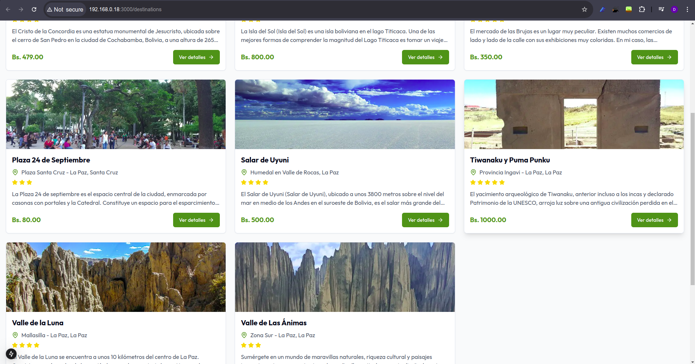

### Gestión de Contenido
- Creación de destinos turísticos
- Edición de información existente
- Sistema de reseñas y calificaciones
- Gestión de imágenes

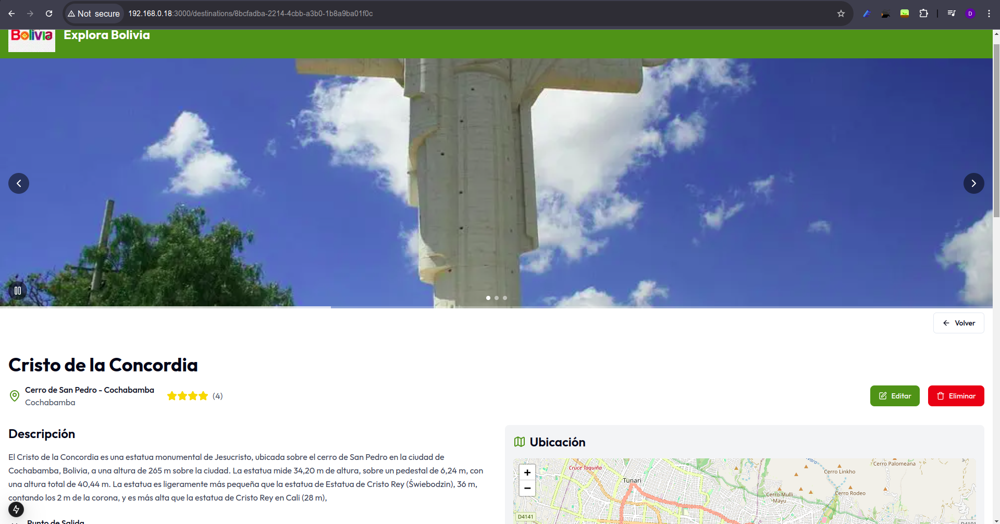

### Edicion de Destinos

Se pueden cambiar todos sus atributos incluyendo imagenes, ubicaicon


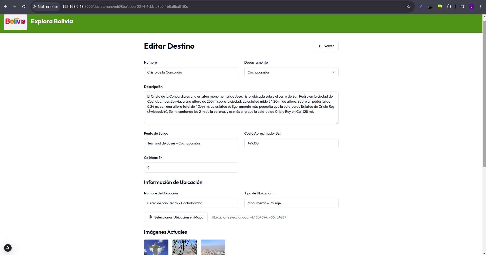

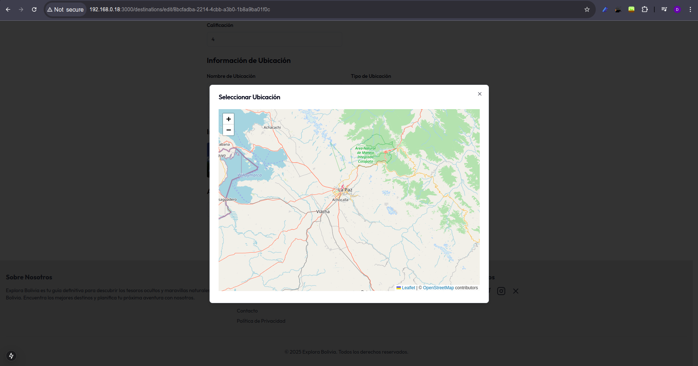

Creacion de destinos

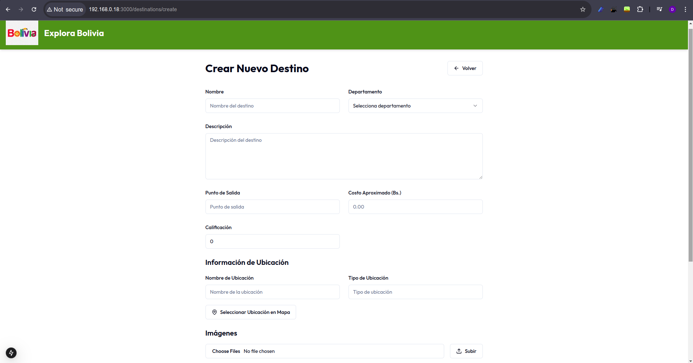

Se pueden anjuntar imagenes desde el dispositivo

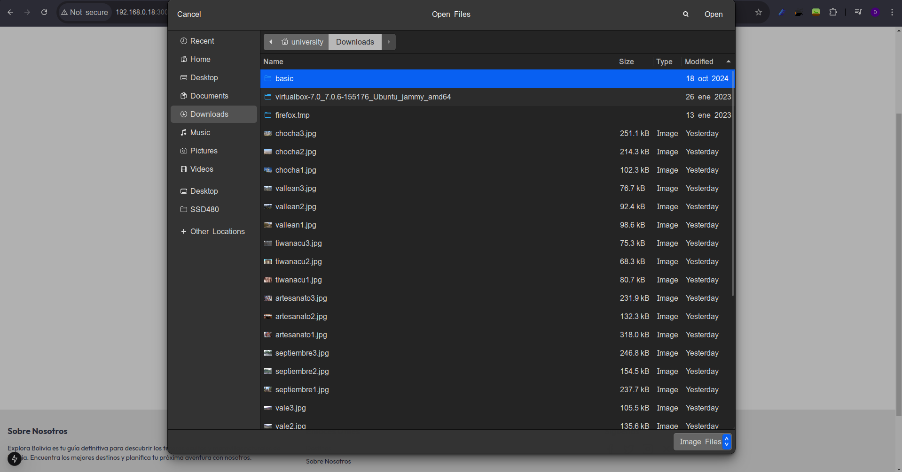

### Mapa Interactivo

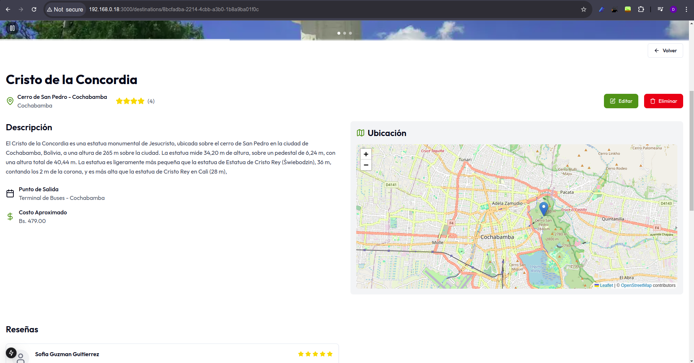


### Resenas

Los usuario pueden comentar y calificar destino, para que las demas personas las vean

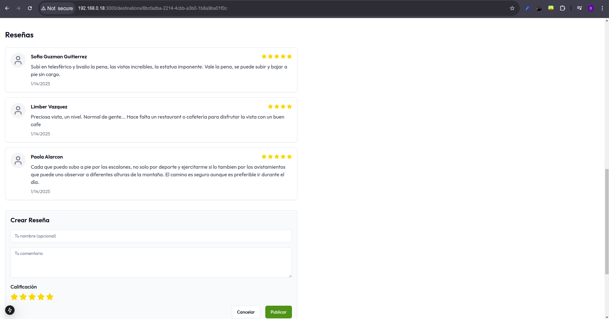

### Filtrado de destinos, buscador

Se pueden realizar busquedas por nombr eo descirpcion, asi tambien como filtrados por precio, departamento en que se encuentran, y ordear de forma acendente o descendente

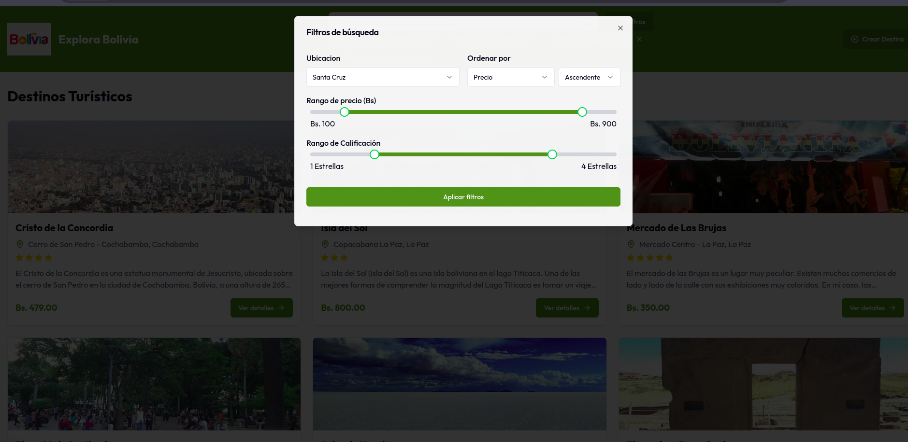

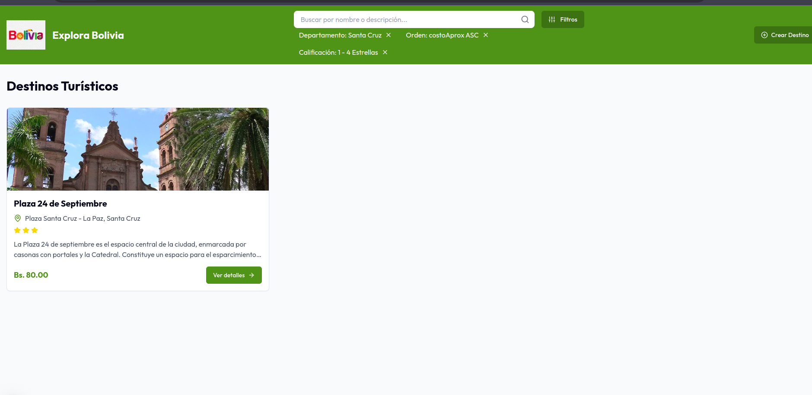

### Interfaz de Usuario
- Diseño responsivo
- Componentes accesibles
- Notificaciones y alertas
- Navegación intuitiva

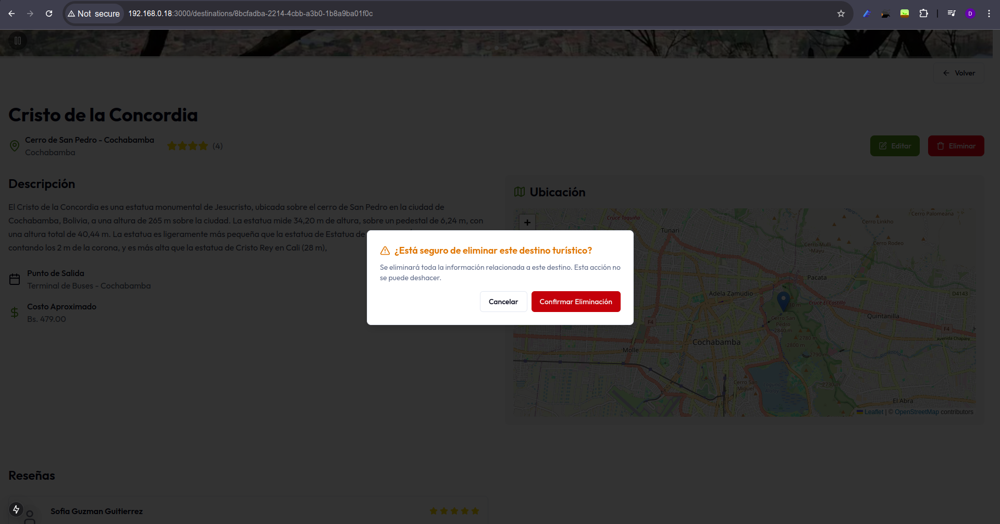

### Diseno Responsivo Adaptable a Tablets Celulates y PC

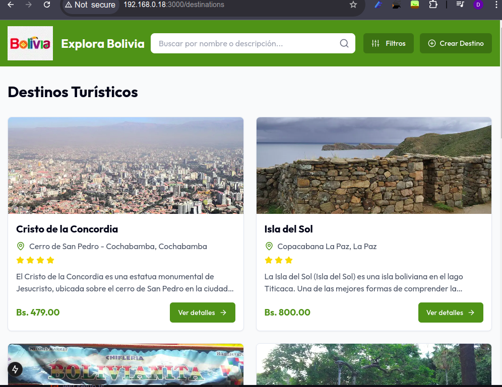

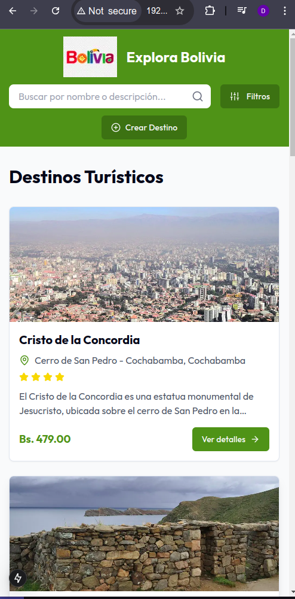

### Despliegue

Se realizo el despliegue con la conexion con el servidor se encuentra en la url

Se aparece alguna advertencia de sitio inseguro se omitr y acceder a esta url

Si el link no responde quiza sea necesario darle permisos desde el navegador a la url del servidor (http://18.231.107.133:4000/api/v1/
) cceder a esta url desde cualquier navegador y acceder tambien luego a la url del cliente que es

### http://56.124.121.148:3000/


## Estructura del Proyecto

```
src/
├── app/                  # Páginas y rutas de la aplicación
├── components/          
│   ├── destinations/    # Componentes específicos de destinos
│   ├── layout/         # Componentes de estructura
│   ├── resenas/        # Componentes de reseñas
│   └── ui/             # Componentes UI reutilizables
├── hooks/               # Hooks personalizados
├── lib/                 # Utilidades y funciones
└── types/              # Definiciones de tipos
```

## Scripts Disponibles

```bash
npm run dev          # Inicia el servidor de desarrollo
npm run build        # Construye la aplicación para producción
npm run start        # Inicia el servidor de producción
npm run lint         # Ejecuta el linter
npm run test         # Ejecuta las pruebas
npm run test:watch   # Ejecuta las pruebas en modo watch
```

## Configuración Docker

El proyecto incluye configuración para Docker:
- Dockerfile optimizado para producción
- Docker Compose para desarrollo
- Variables de entorno gestionadas

## Pipeline CI/CD

El pipeline de GitLab CI/CD incluye:
1. Configuración del entorno
2. Instalación de dependencias
3. Linting
4. Pruebas
5. Construcción de imagen Docker
6. Publicación de imagen
7. Despliegue

## Requisitos del Sistema
- Node.js 20.x o superior
- NPM 9.x o superior
- Docker (opcional)
- Git

## Pruebas
El proyecto utiliza:
- Jest
- Pruebas unitarias
